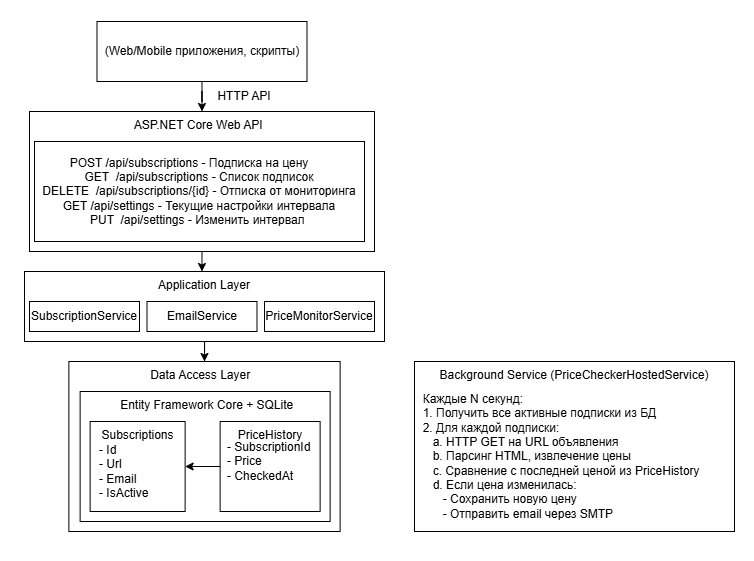

# Prinzip Price Monitor

Сервис для мониторинга изменения цен квартир на сайте [prinzip.su](https://prinzip.su). 
Позволяет подписаться на объявление и получать email-уведомления при изменении цены.

## Быстрый старт

### Запуск через Docker Compose

```bash
docker-compose up --build
```

После запуска сервисы будут доступны по адресам:
- Swagger: http://localhost:5000


| Метод | Endpoint | Описание |
|-------|----------|----------|
| `POST` | `/api/subscriptions` | Подписка на изменение цены |
| `GET` | `/api/subscriptions` | Список подписок с ценами |
| `DELETE` | `/api/subscriptions/{id}` | Отписка от мониторинга |
| `GET` | `/api/settings` | Текущие настройки |
| `PUT` | `/api/settings` | Изменить интервал проверки |

- MailHog (тестовая почта): http://localhost:8025

## Архитектура



*Схема архитектуры приложения Prinzip Price Monitor*

## Что я сделал
- База данных: Взял SQLite. Это идеал для демо и локального запуска — не нужно поднимать тяжелые СУБД. В продакшене меняется на PostgreSQL или MS SQL одной строчкой в конфиге.
- Источник данных: Парсю HTML-страницу. Это проще и универсальнее, чем искать и реверсить скрытый API мобильного приложения, который может меняться без предупреждения.
- Почта: Настроил MailHog для тестов. Письма не уходят в интернет, а сохраняются в локальном веб-интерфейсе, чтобы не спамить реальные ящики при разработке.


## Ограничения и известные шероховатости
- Хрупкость парсинга: Если верстка сайта изменится, CSS-селекторы сломаются. Это классическая и неизбежная проблема веб-скрейпинга.
- Одиночный режим: Фоновый сервис проверки цен работает в одном экземпляре. Если запустить несколько копий приложения (горизонтальное масштабирование), проверки будут дублироваться.
- Риск блокировок: Нет механизмов обхода защит (ротация прокси, User-Agent). При слишком частых запросах сайт может заблокировать IP-адрес сервера.


## Куда расти дальше (пути улучшения)
- Каналы связи: Подключить нормальный SMTP (SendGrid, Яндекс) для продакшена. Как альтернатива — сделать Telegram-бота: это сейчас быстрее, дешевле и удобнее для пользователя, чем email.
- Масштабирование: Добавить Redis для распределенных блокировок и RabbitMQ для очереди задач. Это позволит разнести парсинг и отправку писем на разные серверы.
- Надежность: Внедрить библиотеку Polly для автоматических повторных попыток (retry) при временных сетевых сбоях или таймаутах сайта.
- Умный парсинг: Если сайт начнет активно сопротивляться, переключиться на анализ трафика мобильного приложения (как было предложено в опциональной части задания) — это обычно стабильнее.
